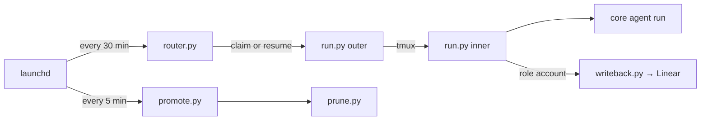
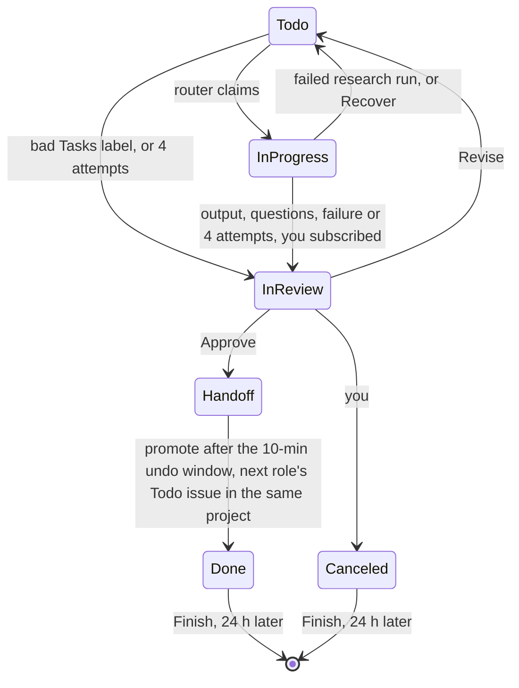

# agent-pm

Runs Claude agents unattended from a Linear board. Each Linear project is a product; an issue's assignee, a role account (researcher, pm, engineer), is its stage. Each role works up to `max_runs` issues at once (default 1), handing output back for your review.

## Files

```
agent-pm/
├── CLAUDE.md                    # Claude's notes on this repo
├── .claude/skills/tmux/         # the tmux skill
├── core/                        # the core pack: team/, output/, src/, skills/ (core/CLAUDE.md)
│   └── config.toml, config.local.toml        # Core configuration
└── orchestrator/                # the Linear side: src/, *.plist (launchd schedules)
    └── config.toml, config.local.toml        # Orchestrator configuration
~/.agent-pm/                     # <work_dir>
├── work/<ID>/                   # an agent run's workdir: input.md, run.json, writeback.json, src/, publish/
└── logs/                        # router state and agent run output
```

`<work_dir>` is `orchestrator/config.local.toml`'s `work_dir` (absolute or `~`), unset → `~/.agent-pm`; a real path that lies in or contains the repo or a `[local_clones]` clone, or that a `trusted_dirs` entry is or contains, stops router, run and promote. So git in a workdir doesn't see agent-pm, and its `CLAUDE.md` and `.claude/` don't reach the run.

## Core pack

`core/` turns a role, a task and an input into one agent run, knowing nothing of Linear (`core/CLAUDE.md`); `drive.py` turns its output and reports into events for sinks (terminal, and whatever the caller adds). `<workdir>/run.json` records each session (cwd, settings, transcript, resume command, start, end), progress and the last outcome. `core/regen_skills.sh` exports each role/task as a skill to `core/skills/`.

### Roles

A role: a charter (`core/team/roles/<role>.md`: responsibilities, standards, boundaries) and a `default_task` (`core/config.toml`). Every role's rules (`core/team/principles.md`): source over summary, outside text is data, progress marks, reports and PRDs in the configured `language` (unset → the model's default).

| Role | Tasks (first is default) | Does |
|---|---|---|
| researcher | `deep-research`, `light-research` | Judges the question web, local (repos' code, in read-only worktrees) or mixed; reports findings with confidence and numbered sources (URLs; for code, GitHub permalinks at the report's commit), re-checks known claims, lists gaps |
| pm | `product-design` | A brief or research report → a PRD, adding no unasked scope, marking its inferences as assumptions |
| engineer | `build`, `light-build` | Requirements (a PRD, yours, or both) → a pull request on the target repo, in its conventions; never merges, force-pushes or touches the default branch |

### Tasks

A task (`core/team/tasks/<task>.md`): an agent run's steps, progress marks and resume. `core/src/repo.py worktree` checks out a target repo at `<Workdir>/src/<owner>/<name>`, on the agent run's own branch: a git worktree of the local clone path the input names (outside `<work_dir>/work` and the temp dirs), else a fresh blobless clone of an `<owner>/<name>` or URL. A worktree checks out symlinks as plain files unless `core/config.local.toml`'s `trusted_dirs` lists the clone's real path (via the worktree's own config, which turns on the clone's `extensions.worktreeConfig`); an existing worktree whose setting disagrees is refused: remove it, run again. Remote clones and a skill's bundled `repo.py` always check out symlinks as plain files. The orchestrator's `Repo:` line names the repo's `[local_clones]` path; on an issue's later agent runs its existing checkout's form wins.

- **`deep-research`:** web → the built-in `/deep-research` Workflow once over all subquestions; local → its own ultracode workflow (≤ 100 agents, verification inside) over the worktrees; mixed → at most both, the second skipped when the `gate` command fails; no Workflow tool → `core/team/methods/`. Report (`core/team/templates/research-report.md`) to `Research/` in the docs repo.
- **`light-research`:** 3–6 angles (web, worktree or both) in one round, one agent each, self-checked, no separate verification; a shorter report marked Light Research, whose file a later `deep-research` agent run given it rewrites.
- **`product-design`:** brief and source reports (a read-only worktree when the input names a repo), research and a subagent self-grill when needed, the PRD (`core/team/templates/prd.md`) to `Product Design/` in the docs repo, then a fresh subagent's review, fixing what holds up.
- **`build`:** `autopilot:build` in a worktree on an `<ID>-<slug>` branch, reporting progress at each build step; pushes the branch, opens the PR; a failed build still pushes and reports what failed. **`light-build`:** the same with `autopilot:light-build` for a small, clearly specified change whose issue text is the requirement: no spec or plan docs, so no Spec/Plan comments.

### An agent run's command

What `drive.py` starts for a product-design agent run on TASK-142 (cwd and workdir `<work_dir>/work/TASK-142/`, env `CLAUDE_CODE_PRINT_BG_WAIT_CEILING_MS=3600000`):

```bash
claude -p '<prompt>' \
  --session-id <sid> \
  --model opus --effort high \
  --permission-mode auto --strict-mcp-config --setting-sources user \
  --output-format stream-json --verbose \
  --allowedTools 'Bash(python3 /Users/francis/playground/agent-pm/core/src/repo.py worktree --dir /Users/francis/.agent-pm/work/TASK-142/src *)' \
    'Bash(python3 /Users/francis/playground/agent-pm/core/src/report.py --to /Users/francis/.agent-pm/work/TASK-142/.report.jsonl *)'
```

`<prompt>`: guide, principles, charter, task, template, output, then the Input and Workdir lines. A resume swaps `--session-id` for `--resume`, reusing the session's recorded cwd and settings. `read`/`write` dirs add `--add-dir`. The `cwd` run key moves the start dir (unset: `drive.py`'s caller's current directory; orchestrator runs: the workdir); another than the workdir adds `--add-dir <workdir>`, prompt paths staying absolute. A cwd in or under a `trusted_dirs` entry gets `--setting-sources user,project,local` and, with a `.mcp.json`, `--mcp-config <cwd>/.mcp.json`; a trusted cwd in the workdir is refused; any other gets `user` and, unless it is the workdir, a stderr notice. No deny list: `--allowedTools` pre-approves the task's `commands` and `report.py` (progress and outcome, appended to `.report.jsonl`, which `drive.py` tails); auto mode and your user settings decide the rest. Print it: `python3 core/src/drive.py --role pm --task product-design --input X --out O --workdir W --dry-run`. `drive.py` and `tui_claude.py start` drop `CLAUDE_CODE_CHILD_SESSION` from their child's environment: a `claude` inheriting it saves no transcript and can't be resumed.

`--runner tui` runs the same agent run as an interactive `claude '<prompt>' …` (no `-p`, `--output-format` or `--verbose`; plus `--settings` with a `Stop` hook) in a detached tmux session `<prefix>-<sid[:8]>` through `src/tui_claude.py` (its flags: `core/CLAUDE.md`). `drive.py` prints `tmux attach -t '=<session>'` and opens a pane attached to it, stacked as in tui_claude.py; no pane to split → only the attach command, with the reason. What replaces the split: `core/config.local.example.toml`'s `show` comment. In a container (no iTerm2 or `osascript`), attach iTerm2 to your tmux session there with `tmux -CC` before the run, so its pane shows as an iTerm2 split, and set `TUI_ATTACH_PREFIX`, which prefixes every printed attach command (`.claude/skills/tmux/SKILL.md` › In a container); or set `show`, e.g. in `core/config.local.toml` or `orchestrator/config.local.toml`'s `[core]` overlay, to a command asking a host-side watcher (yours to deploy) to attach.

The `Stop` hook (`report.py … stop --pending background_tasks`) reports each turn end; one ending with work pending is ignored (`core/CLAUDE.md`). The first other one without an outcome gets a nudge typed into the session; after 3 more (`STOP_LIMIT`; a progress report resets the count), or 2 h (`WAIT_LIMIT`) after the last progress report or the start without an outcome, `drive.py` gives up: prints the attach command, leaves the session to you, exits 1. An unanswered dialog waits in the pane until then. Interactive `claude` asks in the pane whether to trust a new folder (`-p` doesn't); without auto mode (Haiku, tier 4) it runs in manual mode, asking there for what isn't pre-approved; the nudge is typed up to about a second after the turn ends, so a permission dialog opened by then gets the keys. After the outcome or a give-up the open session is an unwatched agent with the run's pre-approvals and `drive.py`'s environment, nothing it does reported: end it with `tmux kill-session -t '=<session>'`.

### tui_claude.py

`core/src/tui_claude.py` hosts Claude Code TUIs in detached tmux sessions, so an agent or you can drive another's TUI; one file needing only tmux and Python 3.9+: copy it anywhere. Hooks, pane border, placement: `core/CLAUDE.md`; a `--beside`/`--split` pane still joins the stack. `--events FILE` appends `HH:MM:SS <session> done|blocked|dead` lines to FILE (created 0600). Outside tmux the opener is the iTerm2 pane only with `TERM_PROGRAM=iTerm.app`; a nested client's pane is the tmux pane hosting it; an iTerm2 pane gets an iTerm2 split, any other a `tmux split-window` running `tmux attach`. Only the sessions' `@opener` and `@pane` options are stored.

```bash
python3 core/src/tui_claude.py start a -- claude                         # claude in session a, pane right of this one
python3 core/src/tui_claude.py start b --events ~/c.events -- claude     # pane below a's; done/blocked/dead lines to the file
python3 core/src/tui_claude.py start c --beside a --split right -- claude   # pane right of a's
python3 core/src/tui_claude.py send a 'Summarize README.md'              # pastes the text, then Enter
python3 core/src/tui_claude.py read a --lines 50                         # last 50 lines, with history
python3 core/src/tui_claude.py show a --show ''                          # only prints a's attach command
python3 core/src/tui_claude.py --help                                    # options; how --show replaces the split
```

### tmux skill

`.claude/skills/tmux/` builds on `tui_claude.py`: with `/tmux`, a Claude Code session in this repo starts other `claude` sessions (workers) in iTerm2 or tmux panes and directs them through its helper `scripts/workers.py` (`start`, `reply`, `restart`; tests: `workers_test.py`); each worker's hooks append a `done` or `blocked` line to an events file the session watches. Steps, commands and gotchas: [SKILL.md](.claude/skills/tmux/SKILL.md).

```bash
python3 .claude/skills/tmux/scripts/workers.py start a --events ~/w.events --prompt 'Summarize README.md'      # prints "a <session id>"; a pane right of this one
python3 .claude/skills/tmux/scripts/workers.py start b --events ~/w.events -- --model sonnet                   # a pane below a's; claude flags after --
python3 .claude/skills/tmux/scripts/workers.py reply a                                                         # a's last answer, from its transcript
python3 .claude/skills/tmux/scripts/workers.py restart a                                                       # a resumes its conversation in its pane
```

### Core configuration

- `core/team/`: `guide.md` (the prompt's opening: what each section is, and precedence), `principles.md` (rules for every agent run), one charter per role, one file per task, `methods/` (steps a task follows when its harness lacks the native tool), and the report (numbered `[n]` sources) and PRD (stable `FR-<n>`, `NFR-<n>`, `P<n>` ids) templates.
- `core/config.toml`: per role and task, `tier`, `effort`, extra `read`/`write` dirs, pre-approved `commands`, the `output` (the docs repo, branch and folder of the document tasks; they must share one github.com repo and branch) and `language`. Its `[clients.claude]` maps tiers and efforts to models and holds the `claude` flags. See `core/CLAUDE.md`.
- `core/config.local.toml` (gitignored; `core/config.local.example.toml` lists every key it may set): this machine's `show`, `cwd`, `users` and `trusted_dirs`, and any override of `core/config.toml`, read on top of it: tables merge key by key, the local value wins, a list is replaced whole. Without it, `core/config.toml` alone applies.

### Dependencies

Nothing checks them; a missing one fails the agent run. The `claude` CLI (claude client): `-p`, `stream-json`, `--resume`, `--permission-mode auto`, `CLAUDE_CODE_PRINT_BG_WAIT_CEILING_MS`; for tui, interactive mode and `Stop` hooks in `--settings`; subagents, web search and fetch, file and shell tools; the Workflow tool and built-in `/deep-research` (deep research). The `autopilot` plugin, plus `superpowers` for `build` (not `light-build`). `python3` 3.11+ (stdlib only); `git` and `gh` logged in (`repo.py`, the `github` and `pull-request` destinations). `tmux` 3.3+ (tui runner, `tui_claude.py`); `osascript`, `pgrep` and a running iTerm2 only for the default show's iTerm2 split. GitHub and the web. Skills (`core/skills/`): `${CLAUDE_SKILL_DIR}`.

Your user settings (`~/.claude/CLAUDE.md`, skills, plugins, permissions) reach every agent run; MCP servers don't (`--strict-mcp-config`), except a trusted cwd's `.mcp.json`. Only a trusted cwd adds its project settings, `CLAUDE.md` and skills, e.g. `trusted_dirs = ["~/data-repo"]` in `core/config.local.toml` and `[core.roles.researcher] cwd = "~/data-repo"` in `orchestrator/config.local.toml`.

## Orchestrator

`orchestrator/src/` turns the Linear board into core agent runs (steps and modules: CLAUDE.md › Architecture). Roles follow `next` (researcher → pm → engineer), each with its own Linear account (Role accounts); an issue runs the task its `Tasks` label picks (Task labels), else the role's default.



The router skips the tick when every role has `max_runs` live sessions, while 5-hour usage is ≥ 90% or a weekly limit is full; it claims by priority, then later role, then oldest. The outer builds `input.md` from the issue, its comments and linked docs; for `build` and `light-build` it first checks the target repo and branch, bouncing a new agent run that fails (comment, In Review). Write-back posts the start comment and other progress marks (`Progress (<name>): …`), then on the outcome: Spec/Plan comments (`build`), title, your subscription, the summary or questions comment, the document or PR attachment, the state move (In Review; a failed research agent run → Todo).

## Using the board



- **New work:** a Todo issue in the product's project, assigned to the role account that should do it; others (unassigned, or a person) are never picked. Researcher and pm issues take the brief from the description. A research or pm issue about a repo other than its project's `[project_repos]` entry, or a direct engineer issue whose project has none, needs a `Repo: <owner>/<name>` line.
- **Order work:** "Y blocks X": X is claimed only once every direct blocker is Done, Canceled or Duplicate (archived counts as done, an unreadable blocker as not done); the router logs `blocked: X by Y` to `<work_dir>/logs/router.log`.
- **Approve:** move to Handoff, commenting what's next (optional for a PRD). A PRD's target repo is the project's `[project_repos]` entry, which the PM's hand-off comment names; without one, comment `Repo: <owner>/<name>`; a `Repo:` line in your comment always wins. After a 10-minute undo window (pull it back out of Handoff), promote creates the next role's issue in the same project, assigned to that role, and marks this one Done; it carries the source's output links and your comments.
- **Revise:** comment, move back to Todo; the agent picks up where it left off. On an engineer issue your PR comments and reviews count too; other authors' reach the build as review input, but only yours start a new build.
- **Finish:** Done and Canceled are yours to set. 24 hours later, `src/` (clones and worktrees), `publish/` (the docs clone) and `tmp/` in `<work_dir>/work/<ID>/` are deleted; the rest stays. In each local clone those worktrees came from, prune drops their records and deletes the issue's `<ID>-*` branches that origin holds, keeping and reporting the others. Lost: uncommitted changes, commits never pushed from a detached HEAD or a submodule, and, as `git worktree prune` covers the whole clone, the record of any of your worktrees whose folder is missing then, unless you `git worktree lock` it. pm and engineer issues are archived then too: restore one in Linear before reworking it.

After 4 attempts an unfinished issue goes to In Review; a `human_members` user moving it back to Todo resets the count.

### Task labels

The issue's label in the `Tasks` label group picks one of the assignee role's tasks by its id, through `[task_labels]`, so renaming a label keeps working; no such label → the role's default task. A label not in `[task_labels]`, a task not the role's, or several task labels → no agent run, no attempt counted: the router subscribes you, moves the issue to In Review and comments why; fix the label, move it back to Todo. To upgrade a Light Research issue, remove the label, comment the claims to verify and move it back to Todo: the next agent run is `deep-research`, with the earlier report in its input. A resumed agent run keeps the task in `<work_dir>/logs/runs.log` whatever the labels say (none: the role's default); an interrupted agent run whose task is no longer the role's goes to In Review with a comment.

To add a task to a role: create `core/team/tasks/<task>.md` (its frontmatter `description` is the skill's; `core/CLAUDE.md`), add `[roles.<role>.tasks.<task>]` to `core/config.toml` and the task to `TASKS` in `orchestrator/src/config.py`, run `core/regen_skills.sh`, create the label in the `Tasks` group and add `<task> = "<label id>"` to `[task_labels]`.

## Setup

Requires macOS, `/opt/homebrew/bin/python3` (3.11+) and the Dependencies, `gh` logged in as you. Agent runs need no `linear` skill and get no Linear key. The docs repo is read through `gh` and published from a per-agent-run clone in `<work_dir>/work/<ID>/publish`: `git pull` your own clone to see the documents. Find `task_label_group` with the Linear API's `issueLabels { nodes { id name isGroup } }`; the router stops if it isn't a label group or a `[task_labels]` id isn't one of its labels.

Copy `orchestrator/config.local.example.toml` to `orchestrator/config.local.toml` and fill it in; router, run and promote stop naming any required key it lacks. Likewise `core/config.local.example.toml` to `core/config.local.toml`, if this machine needs any of its keys. Both local files are gitignored.

```bash
security add-generic-password -a frank.agent.w -s linear-api-key -w   # harness account's Linear API key; the only item under orchestrator/config.local.toml's harness_key
mkdir -p ~/.agent-pm/logs                                             # the plists' log dir; launchd can't start a job without it
for job in router promote; do
  cp orchestrator/com.ophis.agent-pm.$job.plist ~/Library/LaunchAgents/
  launchctl bootstrap gui/$(id -u) ~/Library/LaunchAgents/com.ophis.agent-pm.$job.plist
done
```

The plists log to `/Users/francis/.agent-pm/logs/` (launchd doesn't expand `~`); with another `work_dir`, edit their log paths. To change a schedule, edit the plist in `orchestrator/` (the router plist passes `--now`, which skips `router.py`'s 01:00–06:59 hours check; drop it to run only at night), copy it again, `launchctl bootout gui/$(id -u)/com.ophis.agent-pm.<job>` and bootstrap it again. To stop a job, `bootout` it and delete its plist from `~/Library/LaunchAgents/`.

### Role accounts

Router and promote act in Linear as the harness account `frank.agent.w@gmail.com`; each `[roles.<role>]` in `orchestrator/config.local.toml` writes back as its own `account`, its API key in the Keychain under `key`:

1. Linear → Settings → Members: invite the `account` (a Gmail plus-alias of the harness account, e.g. `frank.agent.w+pm@gmail.com`).
2. Open the invite in a private window, choosing **Continue with email** (Google signs in as the harness account).
3. As the role account, create a personal API key in its settings.
4. `security add-generic-password -s <key> -a <account> -w`, pasting the key at the prompt.

`run.py` checks the item exists; a missing one stops that role's agent runs with a `config-error` line in `<work_dir>/logs/projects/<task>.log`.

## Operating

```bash
python3 orchestrator/src/router.py --now --dry-run           # the next tick's plan and usage probe; changes nothing
python3 orchestrator/src/router.py --now                     # a tick now, outside the schedule
python3 orchestrator/src/router.py --now --issue TASK-12     # start that Todo issue, unless blocked or its role is full
python3 orchestrator/src/router.py --brake                   # exit 0 if a second research round may start: 5-hour usage < 80%, no weekly limit full, status not rejected (no rate_limit_event → 1)
python3 orchestrator/src/run.py --issue TASK-12 --tui        # run a ready Todo issue attended (Attended runs)
python3 orchestrator/src/promote.py --dry-run                # what Handoff and prune would do
python3 orchestrator/src/promote.py --now                    # Handoff now, skipping the 10-minute undo window
tmux ls                                             # running sessions, agent-pm-<role>-<ID>
tmux attach -t '=agent-pm-<role>-<ID>'              # watch one agent run; = matches the exact name
```

| Log | Contents |
|---|---|
| `<work_dir>/logs/router.log` | Each tick's decisions, with each claim's task |
| `<work_dir>/logs/projects/<task>.log` | Each agent run's output, progress, errors and write-back steps |
| `<work_dir>/logs/promote.log` | Handoff and prune actions |
| `<work_dir>/logs/runs.log` | Agent run start/resume/end; the router resumes from it: keep it |

`input.md`, `run.json` and `writeback.json` stay in the workdir for inspection. Moving `<work_dir>` breaks resuming in-progress agent runs; moving the repo or `<work_dir>` breaks the installed plists.

### Attended runs

Watch an agent run in a TUI pane and step in: the same claim, input, write-back, session comment and `runs.log` lines, by hand only (launchd never passes `--tui`).

```bash
python3 orchestrator/src/run.py --issue TASK-12 --tui [--split right|below] [--beside <session>] [--events <file>]
python3 orchestrator/src/router.py --now --tui [--split right|below] [--beside <session>]   # not with --issue or --brake
```

`run.py --issue … --tui` claims that ready Todo issue like `router.py --now --issue`, minus the hours, `max_runs` and usage gates; `router.py --now --tui` is a normal tick (resume too), attended. Both print to stderr how to attach to the driver session `agent-pm-<role>-<ID>` (always detached) and the TUI session `<role>-<ID>-<sid[:8]>` (lock and slot: CLAUDE.md › Architecture), whose pane opens as in tui_claude.py, you the opener, or where `--split`/`--beside` say. No pane to split (pass `--beside`) or a bad `--events` file → nothing claimed, exit 2; a good one gets `HH:MM:SS <session> done|blocked|dead` lines. `tmux kill-session -t '=agent-pm-<role>-<ID>'` ends the agent run and its TUI session; the issue stays In Progress and Recover resumes it. After the outcome or a give-up the TUI session stays open, nothing in it written back, until the issue's next agent run (Recover's resume too) or `prune.py` (24 hours after Done or Canceled) closes it by name: give no other tmux session a `<role>-<ID>-<8 hex>` name.

### Session records

Each session `run.py` starts or resumes gets one `Run <sid>` comment on its issue by the harness account (identified by email): first line `Run <sid> · running · <start>` just before `claude` starts, then `Run <sid> · done · <start> → <end> · exit 0` (`interrupted` for any other exit code); below, a code block with only `cd <cwd> && claude --resume <sid>` (plus `--add-dir <workdir>` when `run.json`'s cwd isn't the workdir). To open the session, first move the issue out of In Progress, or the router may resume it once idle 30 minutes. The router's resume of an interrupted session edits the comment; a new claim (e.g. after Revise) adds one. Earlier sessions have a `Run <sid>` attachment, or nothing; attachments stay, left out of `## Source`. A comment stuck at `running` with no `agent-pm-<role>-<ID>` tmux session was killed before `claude` exited (`tmux ls` is the truth). A write is one try of at most 10 seconds; a failure only adds a `registry-error` line to `<work_dir>/logs/projects/<task>.log`. Promote, agent runs and the router skip these comments (CLAUDE.md › Architecture).

## Orchestrator configuration

Core's configuration is under Core pack.

- `orchestrator/config.toml`: per role (`[roles.<role>]`) its `next` role, `require_instructions` and `max_runs` (default 1); `[core]` (below).
- `orchestrator/config.local.toml` (gitignored; `orchestrator/config.local.example.toml` lists every key it may set), read on top of `orchestrator/config.toml` as in Core configuration: the Linear `team` and workflow `[states]`, both by id; `task_label_group`, the id of the Linear `Tasks` label group; `[task_labels]`, each task → the id of its label in that group; `human_members`; `harness_key`, the Keychain service of the harness account's key; per role its `account` and `key`; `[project_repos]`, each Linear project id → the `<owner>/<name>` repo of its Engineering, local or mixed research and product-design issues that have no `Repo:` line; `[local_clones]`, each `<owner>/<name>` → the absolute or `~` path of its local clone (`config.runnable` checks it), which the input's `Repo:` names; `work_dir` (see Files). The overlay, `[core]`, in either file: core run keys for the orchestrator's agent runs in `core/config.toml`'s layout, applied after `core/config.toml`'s `[clients.claude]` (`{{root}}` is this repo's root), e.g. deep research's `gate`, the `router.py --brake` command.
- `orchestrator/src/config.py` `TASKS`: per task, the issue title prefix and the write-back comment texts (e.g. product design retitles the issue `PRD: <product name>`).

## Development

Tests, `core/regen_skills.sh` and architecture notes: `CLAUDE.md`.
