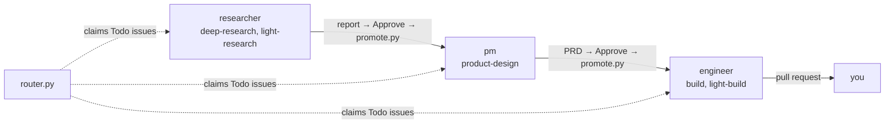
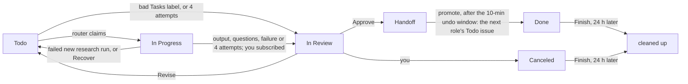
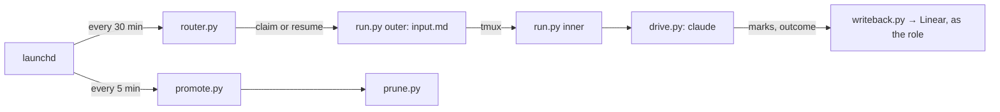

# agent-pm

Runs Claude agents unattended from a Linear board. Each Linear project is a product; an issue's assignee, a role account, is its stage. Each role works up to `max_runs` issues at once (default 1), handing its output back for your review; once you approve, the next role takes it. `core/` runs a role on a task, knowing nothing of Linear, and is a Claude Code plugin you can use alone (Install); `orchestrator/` runs it from the board (Setup). Developers: `CLAUDE.md`.



## Install

`/plugin marketplace add ophis/agent-pm`, then `/plugin install agent-pm@agent-pm` (a private repo: your git credentials). Requires the `claude` CLI, Python 3.11+ (stdlib only), tmux 3.3+ (the tmux skill, tui runs), `git` and `gh` logged in (checkouts, the `github` and `pull-request` destinations), the `autopilot` plugin (plus `superpowers` for `build`), GitHub and the web; `osascript`, `pgrep` and a running iTerm2 only for the default iTerm2 split. Nothing checks them: a missing one fails the agent run. Agent runs load your user settings (`~/.claude/CLAUDE.md`, skills, permissions, plugins but `agent-pm`) and no MCP servers; only a cwd in or under a `trusted_dirs` entry (`core/config.toml`'s `cwd` and `trusted_dirs`) adds its project settings, `CLAUDE.md`, skills and `.mcp.json`.

- `/agent-pm:tmux`: start and direct other Claude Code sessions (workers) in iTerm2 or tmux panes, or run a core role/task in a pane or headless: `core/skills/tmux/SKILL.md`.
- `/agent-pm:act-as <role> <task> <input>`: run a core role/task in this conversation: `core/skills/act-as/SKILL.md`.

## Setup

Requires macOS, `/opt/homebrew/bin/python3` (3.11+), Install's requirements and `gh` logged in as you. The orchestrator runs this checkout's scripts, not the plugin.

1. Create `~/.agent-pm/orchestrator.local.toml` from `orchestrator/config.toml`'s `# local:` lines, uncommented, with your values; router, run and promote stop naming any required key it lacks. Likewise `~/.agent-pm/core.local.toml` from `core/config.toml`'s: at least the document tasks' `[output]`: one github.com docs repo and branch, a folder per task. `<work_dir>` is the `work_dir` key, default `~/.agent-pm`: each issue's workdir `<work_dir>/work/<ID>/`, and the logs.
2. Find `task_label_group` with the Linear API's `issueLabels { nodes { id name isGroup } }`; the router stops if it isn't a label group or a `[task_labels]` id isn't one of its labels.
3. Agent runs need no `linear` skill and get no Linear key: router and promote act in Linear as the harness account `frank.agent.w@gmail.com`, each role's write-back as its `[roles.<role>]` `account`, its API key in the Keychain under `key`. Per role:
   1. Linear → Settings → Members: invite the `account` (a Gmail plus-alias of the harness account, e.g. `frank.agent.w+pm@gmail.com`).
   2. Open the invite in a private window, choosing **Continue with email** (Google signs in as the harness account).
   3. As the role account, create a personal API key in its settings.
   4. `security add-generic-password -s <key> -a <account> -w`, pasting the key at the prompt. `run.py` checks the item exists; a missing one stops that role's agent runs with a `config-error` line in `<work_dir>/logs/projects/<task>.log`.
4. The harness account's key, the logs dir and the schedules:
   ```bash
   security add-generic-password -a frank.agent.w -s linear-api-key -w   # the only item under orchestrator.local.toml's harness_key
   mkdir -p ~/.agent-pm/logs                                             # the plists' log dir; launchd can't start a job without it
   for job in router promote; do cp orchestrator/com.ophis.agent-pm.$job.plist ~/Library/LaunchAgents/ && launchctl bootstrap gui/$(id -u) ~/Library/LaunchAgents/com.ophis.agent-pm.$job.plist; done
   ```

The plists log to `/Users/francis/.agent-pm/logs/` (launchd doesn't expand `~`): with another `work_dir`, edit their log paths. The router plist passes `--now`, which skips `router.py`'s 01:00–06:59 hours check: drop it to run only at night. To change a schedule, edit the plist in `orchestrator/`, copy it again, `launchctl bootout gui/$(id -u)/com.ophis.agent-pm.<job>` and bootstrap it again; to stop a job, `bootout` it and delete its plist from `~/Library/LaunchAgents/`.

## Using the board



- **New work:** a Todo issue in the product's project, assigned to the role account that should do it; others (unassigned, or a person) are never picked. Researcher and pm issues take the brief from the description; a direct engineer issue's text is its requirement. A research or pm issue about a repo other than its project's `[project_repos]` entry, or a direct engineer issue whose project has none, needs a `Repo: <owner>/<name>` line.
- **Order work:** the router claims by priority, then later role, then oldest. "Y blocks X": X is claimed only once every direct blocker is Done, Canceled or Duplicate (archived counts as done, an unreadable blocker as not done); the router logs `blocked: X by Y` to `<work_dir>/logs/router.log`.
- **Approve:** move to Handoff, commenting what's next (optional for a PRD). A PRD's target repo is the project's `[project_repos]` entry, which the PM's hand-off comment names; without one, comment `Repo: <owner>/<name>`; a `Repo:` line in your comment always wins. After a 10-minute undo window (pull it back out of Handoff), promote creates the next role's issue in the same project, assigned to that role, and marks this one Done; it carries the source's output links and your comments.
- **Revise:** comment, move back to Todo; the agent picks up where it left off. On an engineer issue your PR comments and reviews count too; other authors' reach the build as review input, but only yours start a new build. After 4 attempts an unfinished issue goes to In Review; a `human_members` user moving it back to Todo resets the count.
- **Finish:** Done and Canceled are yours to set. 24 hours later, `src/` (clones and worktrees), `publish/` (the docs clone) and `tmp/` in `<work_dir>/work/<ID>/` are deleted; the rest stays. In each local clone those worktrees came from, prune drops their records and deletes the issue's `<ID>-*` branches that origin holds, keeping and reporting the others. Lost: uncommitted changes, commits never pushed from a detached HEAD or a submodule, and, as `git worktree prune` covers the whole clone, the record of any of your worktrees whose folder is missing then, unless you `git worktree lock` it. pm and engineer issues are archived then too: restore one in Linear before reworking it.

### Task labels

The issue's label in the `Tasks` label group picks one of the assignee role's tasks by its id, through `[task_labels]`, so renaming a label keeps working; no such label → the role's default task, the first in the diagram at the top. What each task does and when to use it: the `description` atop `core/team/tasks/<task>.md`. A label not in `[task_labels]`, a task not the role's, or several task labels → no agent run, no attempt counted: the router subscribes you, moves the issue to In Review and comments why; fix the label, move it back to Todo. To upgrade a Light Research issue, remove the label, comment the claims to verify and move it back to Todo: the next agent run is `deep-research`, with the earlier report in its input. A resumed agent run keeps the task in `<work_dir>/logs/runs.log` whatever the labels say (none: the role's default); an interrupted agent run whose task is no longer the role's goes to In Review with a comment.

## Operating



```bash
python3 orchestrator/src/router.py --now --dry-run           # the next tick's plan and usage probe; changes nothing
python3 orchestrator/src/router.py --now                     # a tick now, outside the schedule
python3 orchestrator/src/router.py --now --issue TASK-12     # start that Todo issue, unless blocked or its role is full
python3 orchestrator/src/promote.py --dry-run                # what Handoff and prune would do
python3 orchestrator/src/promote.py --now                    # Handoff now, skipping the 10-minute undo window
tmux ls                                                      # running sessions, agent-pm-<role>-<ID>
tmux attach -t '=agent-pm-<role>-<ID>'                       # watch one agent run; = matches the exact name
```

| Log | Contents |
|---|---|
| `<work_dir>/logs/router.log` | Each tick's decisions, with each claim's task |
| `<work_dir>/logs/projects/<task>.log` | Each agent run's output, progress, errors and write-back steps |
| `<work_dir>/logs/promote.log` | Handoff and prune actions |
| `<work_dir>/logs/runs.log` | Agent run start/resume/end; the router resumes from it: keep it |

`input.md`, `run.json` and `writeback.json` stay in the workdir for inspection; documents are published from a per-agent-run clone in `<work_dir>/work/<ID>/publish`: `git pull` your own docs clone to see them. Each session gets a `Run <sid>` comment on its issue, holding `cd <cwd> && claude --resume <sid>`: to open the session, first move the issue out of In Progress, or the router may resume it once idle 30 minutes. Moving `<work_dir>` breaks resuming in-progress agent runs; moving the repo or `<work_dir>` breaks the installed plists.

### Attended runs

```bash
python3 orchestrator/src/run.py --issue TASK-12 --tui [--split right|below] [--split-from <session>] [--events <file>]
python3 orchestrator/src/router.py --now --tui [--split right|below] [--split-from <session>]   # not with --issue or --brake
```

Watch an agent run in a TUI pane and step in: the same claim, input, write-back, session comment and `runs.log` lines, by hand only (launchd never passes `--tui`). `run.py --issue … --tui` claims that ready Todo issue like `router.py --now --issue`, minus the hours, `max_runs` and usage gates; `router.py --now --tui` is a normal tick (resume too), attended. Both print to stderr how to attach to the driver session `agent-pm-<role>-<ID>` (always detached) and the TUI session `<role>-<ID>-<sid[:8]>` (lock and slot: `CLAUDE.md` › Architecture), whose pane opens as a worker's does (`core/skills/tmux/SKILL.md` › Start), you the opener, or where `--split`/`--split-from` say. No pane to split (pass `--split-from`) or a bad `--events` file → nothing claimed, exit 2; a good one gets `HH:MM:SS <session> done|blocked|dead` lines. `tmux kill-session -t '=agent-pm-<role>-<ID>'` ends the agent run and its TUI session; the issue stays In Progress and Recover resumes it. After the outcome or a give-up the TUI session stays open, nothing in it written back, until the issue's next agent run (Recover's resume too) or `prune.py` (24 hours after Done or Canceled) closes it by name: give no other tmux session a `<role>-<ID>-<8 hex>` name.
